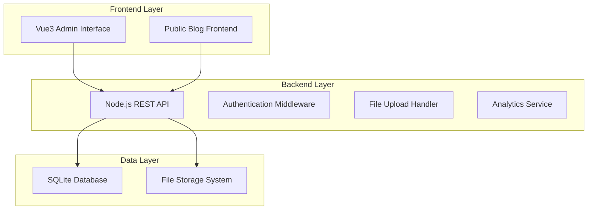

# Design Document

## Overview

The JonAI-Lab Blog Admin System is a full-stack web application consisting of a Vue3 frontend admin interface and a Node.js REST API backend with SQLite database. The system follows a modern three-tier architecture with clear separation between presentation, business logic, and data layers. The design emphasizes security, performance, and maintainability while providing an intuitive user experience for content management.

## Architecture

### System Architecture



### Technology Stack

**Frontend (Admin Interface):**
- Vue3 with Composition API
- Vue Router for navigation
- Pinia for state management
- Axios for HTTP requests
- Quill.js or TinyMCE for rich text editing
- Element Plus or Ant Design Vue for UI components

**Backend API:**
- Node.js with Express.js framework
- JWT for authentication
- Multer for file uploads
- SQLite3 with better-sqlite3 driver
- bcrypt for password hashing
- express-rate-limit for security

**Database:**
- SQLite for development and production
- Database migrations using custom migration system

## Components and Interfaces

### Frontend Components

#### Core Layout Components
- `AdminLayout.vue` - Main admin layout with navigation
- `Sidebar.vue` - Navigation sidebar with menu items
- `Header.vue` - Top header with user info and logout

#### Dashboard Components
- `Dashboard.vue` - Main dashboard view
- `MetricsCard.vue` - Reusable metric display card
- `TopArticlesChart.vue` - Top articles ranking display
- `RecentActivity.vue` - Recent articles activity feed

#### Article Management Components
- `ArticleList.vue` - Articles listing with pagination and filters
- `ArticleEditor.vue` - Rich text article editor
- `ArticleForm.vue` - Article metadata form
- `ImageUpload.vue` - Thumbnail upload component
- `CategoryManager.vue` - Article category management

#### Authentication Components
- `Login.vue` - Login form
- `AuthGuard.vue` - Route protection component

### Backend API Endpoints

#### Authentication Endpoints
```
POST /api/auth/login
POST /api/auth/logout
GET /api/auth/verify
```

#### Article Management Endpoints
```
GET /api/articles - List articles with pagination
POST /api/articles - Create new article
GET /api/articles/:id - Get article by ID
PUT /api/articles/:id - Update article
DELETE /api/articles/:id - Delete article
POST /api/articles/:id/publish - Publish draft article
```

#### Category Management Endpoints
```
GET /api/categories - List all categories
POST /api/categories - Create new category
PUT /api/categories/:id - Update category
DELETE /api/categories/:id - Delete category
```

#### Analytics Endpoints
```
GET /api/analytics/dashboard - Dashboard metrics
GET /api/analytics/articles/top - Top performing articles
POST /api/articles/:id/view - Increment view count
POST /api/articles/:id/like - Toggle like
```

#### File Upload Endpoints
```
POST /api/upload/thumbnail - Upload article thumbnail
```

## Data Models

### Database Schema

#### Users Table
```sql
CREATE TABLE users (
    id INTEGER PRIMARY KEY AUTOINCREMENT,
    username VARCHAR(50) UNIQUE NOT NULL,
    email VARCHAR(100) UNIQUE NOT NULL,
    password_hash VARCHAR(255) NOT NULL,
    role VARCHAR(20) DEFAULT 'admin',
    created_at DATETIME DEFAULT CURRENT_TIMESTAMP,
    updated_at DATETIME DEFAULT CURRENT_TIMESTAMP
);
```

#### Categories Table
```sql
CREATE TABLE categories (
    id INTEGER PRIMARY KEY AUTOINCREMENT,
    name VARCHAR(100) UNIQUE NOT NULL,
    description TEXT,
    slug VARCHAR(100) UNIQUE NOT NULL,
    created_at DATETIME DEFAULT CURRENT_TIMESTAMP,
    updated_at DATETIME DEFAULT CURRENT_TIMESTAMP
);
```

#### Articles Table
```sql
CREATE TABLE articles (
    id INTEGER PRIMARY KEY AUTOINCREMENT,
    title VARCHAR(255) NOT NULL,
    slug VARCHAR(255) UNIQUE NOT NULL,
    content TEXT NOT NULL,
    excerpt TEXT,
    thumbnail_url VARCHAR(500),
    category_id INTEGER NOT NULL,
    author_id INTEGER NOT NULL,
    status VARCHAR(20) DEFAULT 'draft',
    view_count INTEGER DEFAULT 0,
    like_count INTEGER DEFAULT 0,
    published_at DATETIME,
    created_at DATETIME DEFAULT CURRENT_TIMESTAMP,
    updated_at DATETIME DEFAULT CURRENT_TIMESTAMP,
    FOREIGN KEY (category_id) REFERENCES categories(id),
    FOREIGN KEY (author_id) REFERENCES users(id)
);
```

#### Article Likes Table (for tracking unique likes)
```sql
CREATE TABLE article_likes (
    id INTEGER PRIMARY KEY AUTOINCREMENT,
    article_id INTEGER NOT NULL,
    ip_address VARCHAR(45) NOT NULL,
    user_agent TEXT,
    created_at DATETIME DEFAULT CURRENT_TIMESTAMP,
    FOREIGN KEY (article_id) REFERENCES articles(id),
    UNIQUE(article_id, ip_address)
);
```

### API Response Models

#### Article Response Model
```typescript
interface Article {
    id: number;
    title: string;
    slug: string;
    content: string;
    excerpt: string;
    thumbnail_url: string;
    category: {
        id: number;
        name: string;
        slug: string;
    };
    author: {
        id: number;
        username: string;
    };
    status: 'draft' | 'published' | 'archived';
    view_count: number;
    like_count: number;
    published_at: string | null;
    created_at: string;
    updated_at: string;
}
```

#### Dashboard Metrics Model
```typescript
interface DashboardMetrics {
    total_articles: number;
    total_views: number;
    total_likes: number;
    recent_articles: Article[];
    top_articles: Article[];
    views_trend: {
        date: string;
        views: number;
    }[];
}
```

## Error Handling

### Frontend Error Handling
- Global error interceptor for HTTP requests
- User-friendly error messages with toast notifications
- Form validation with real-time feedback
- Loading states for all async operations
- Retry mechanisms for failed requests

### Backend Error Handling
- Centralized error handling middleware
- Structured error responses with consistent format
- Input validation using express-validator
- Database constraint error handling
- File upload error handling (size, type validation)

### Error Response Format
```typescript
interface ErrorResponse {
    success: false;
    error: {
        code: string;
        message: string;
        details?: any;
    };
    timestamp: string;
}
```

## Testing Strategy

### Frontend Testing
- Unit tests for Vue components using Vue Test Utils and Vitest
- Integration tests for API interactions
- E2E tests for critical user flows using Cypress
- Component visual regression testing

### Backend Testing
- Unit tests for API endpoints using Jest and Supertest
- Database integration tests with test database
- Authentication and authorization tests
- File upload functionality tests
- Performance tests for analytics queries

### Test Coverage Goals
- Minimum 80% code coverage for backend API
- Critical path testing for all user stories
- Database migration testing
- Security testing for authentication flows

### Testing Environment
- Separate test database (SQLite in-memory for speed)
- Mock external services and file uploads
- Automated testing in CI/CD pipeline
- Load testing for analytics endpoints

## Security Considerations

### Authentication & Authorization
- JWT tokens with short expiration (1 hour)
- Refresh token mechanism
- Rate limiting on login attempts
- Password strength requirements
- Secure session management

### Data Protection
- Input sanitization and validation
- SQL injection prevention using parameterized queries
- XSS protection with content security policy
- File upload restrictions (type, size, location)
- Secure file storage outside web root

### API Security
- CORS configuration for admin interface
- Request rate limiting
- API versioning for future compatibility
- Audit logging for admin actions